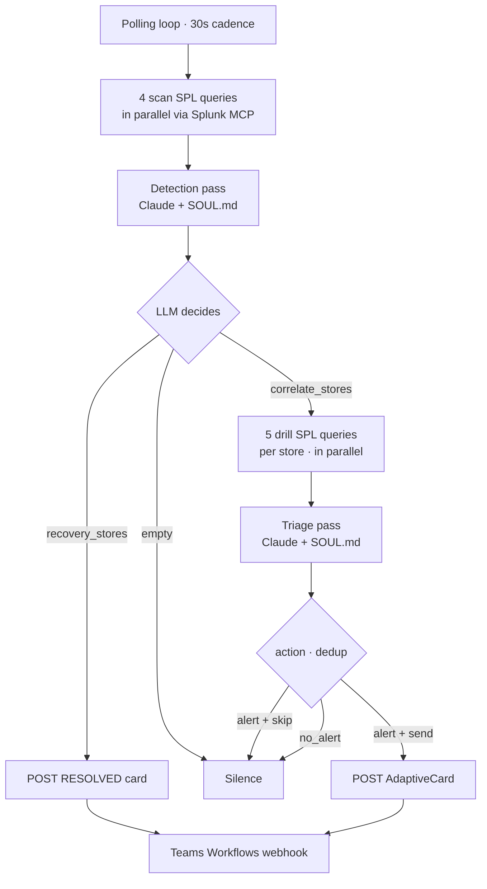

# Network Triage Agent

An LLM-powered network triage agent for retail store fleets. Every 30 seconds it polls four Cisco data domains via a Splunk MCP server, hands the raw results to Claude Sonnet (with a domain-specific system prompt), and posts AdaptiveCard alerts to a Microsoft Teams Workflows channel.

The LLM is the brain. Python is plumbing — query execution, webhook POST, polling cadence. Detection thresholds, scope and severity reasoning, root-cause attribution across domains, dedup, and recovery decisions all live in [`SOUL.md`](#souldmd--the-system-prompt) and are produced at runtime by the model. Adding a new failure scenario or changing severity behavior is a prompt edit, not a code change.

## Architecture



The four data domains, in triage order:

1. **SD-WAN** — `cisco:sdwan:tunnelhealth`, `cisco:sdwan:sitehealth`
2. **ThousandEyes** — `cisco:thousandeyes:alerts`, `cisco:thousandeyes:pathtrace`, `cisco:thousandeyes:bgp`
3. **Meraki** — `meraki:accesspoints`, `meraki:switches`, `meraki:securityappliances`
4. **Cisco ISE** — `cisco:ise:syslog`

The 3-digit store number is the universal correlation key extracted from hostnames (`kl-237-portland-rtr-1`), Meraki networkIds (`N_KL0000237`), and ISE device names (`KL-237-AP`).

## Repository layout

```
main.py              Polling loop + orchestrator
llm_client.py        Anthropic SDK wrapper · two tool schemas
splunk_client.py     MCP stdio bridge wrapper
correlation.py       Parallel drill-query runner
teams_card.py        AdaptiveCard builder + webhook POST
state.py             Per-store alert memory (passive)
events.py            Structured stdout JSONL event stream
queries.py           SPL query strings (verbatim from SOUL.md spec)
store.py             Store-ID extraction helpers
config.py            Env loader
mock_splunk.py       Canned Splunk data for offline demo
mock_llm.py          Scripted LLM responses for offline demo
SOUL.md.example      System-prompt template
.env.example         Configuration template
requirements.txt
Dockerfile           Container image (Python + Node for the mcp-remote bridge)
k8s/                 Kubernetes manifests + deployment runbook
```

## Quick start

### Prerequisites

- Python 3.11+
- A running Splunk MCP server (typically reached via `mcp-remote` over stdio)
- An Anthropic API key
- A Microsoft Teams Workflows incoming-webhook URL

### Install

```bash
git clone https://github.com/gdcosta/network-triage-agent.git
cd network-triage-agent
python3 -m venv .venv
source .venv/bin/activate
pip install -r requirements.txt
```

### Configure

```bash
cp .env.example .env
cp SOUL.md.example SOUL.md
```

Then edit both:

- **`.env`** — fill in `ANTHROPIC_API_KEY`, `TEAMS_WEBHOOK_URL`, `SPLUNK_MCP_COMMAND`, `SPLUNK_MCP_ARGS`. If your Splunk uses a self-signed cert, the included `SPLUNK_MCP_ENV=NODE_TLS_REJECT_UNAUTHORIZED=0` lets the Node `mcp-remote` bridge connect anyway.
- **`SOUL.md`** — replace the `<your-mcp-server>` / `example.com` / `<Your Retail Company>` placeholders with your real fleet conventions: store-ID pattern, hostname format, ISE NAS-IP scheme, ThousandEyes agent naming.

Both files are gitignored, so your customizations and secrets never leave the machine.

### Preflight

```bash
python main.py --check
```

Runs three independent checks and reports pass/fail per component, so failures are isolated:

1. **SOUL.md** — file present, readable, approximate token count
2. **Anthropic API** — model responds, token usage reported
3. **Splunk MCP** — bridge subprocess launches, session initializes, configured tool is exposed, trivial query (`| makeresults count=1`) returns

### Run

```bash
python main.py | jq -c
```

The agent emits a structured JSONL stream on stdout — every poll, every LLM decision with rationale, every card POST. Stop with `Ctrl-C` for a clean shutdown via the SIGINT handler.

### Try it offline

```bash
python main.py --mock
```

Uses canned Splunk data and a scripted LLM (no API key, no Splunk, no Teams). Cycles through 6 scenarios — healthy → P2 alert → dedup skip → P1 escalation → recovery → healthy — so you can watch the full pipeline end-to-end. Pair with `POLL_INTERVAL_SECONDS=2` to compress the demo into ~12 seconds.

If you set `ANTHROPIC_API_KEY` while passing `--mock`, the canned Splunk data is sent to the real Sonnet model — useful for iterating on `SOUL.md` without burning real Splunk queries.

## `SOUL.md` — the system prompt

`SOUL.md` is the entire intelligence of the agent. It defines:

- Which sourcetypes belong to which data domains
- Both detection layers — Layer 1 (KPI thresholds, e.g. `tunnel_states="down"`) and Layer 2 (fleet-relative outliers, e.g. `>2x median jitter`)
- Triage stages — scope → root cause domain → severity → confidence → recommendation
- Severity bands — `P1 CRITICAL` / `P2 HIGH` / `P3 MEDIUM` / `RESOLVED`, and what triggers each
- Business impact mapping — which ISE service-account names map to revenue, inventory, operations, etc.
- Dedup rules and recovery card behavior

The model invokes one of two tool schemas per cycle:

- **`detection_decision`** (after scans) — emits `correlate_stores`, `recovery_stores`, and a one-line `summary`.
- **`submit_triage_reports`** (after drills) — emits one report per store with severity, root cause, recommendation, and its own send/skip dedup verdict.

Tool-use enforcement (`tool_choice` forces the call) means enums like `severity`, `scope`, and `dedup_decision` are validated API-side — the model can't drift to unexpected values.

The prompt ships with prompt caching enabled (`cache_control: ephemeral`), so the system-prompt tokens are reprocessed only once per 5-minute cache window. With 30s polling, every cycle within a window is a cache hit. The `llm.detection_pass` / `llm.triage_pass` events report `cache_read` and `cache_create` token counts so cost is observable.

## Output / observability

Every run produces a JSONL event stream on stdout, designed for an OpenTelemetry collector (`filelog` receiver in Kubernetes, or a container log shipper) to forward into your SIEM with no parsing config. Each event has:

- `ts` — ISO 8601 UTC
- `event` — dotted name (`poll.start`, `triage.report`, `card.posted`, …)
- `cycle_id` — groups all events from one poll cycle

Decision events additionally carry `decided`, `rationale`, and `inputs` so the audit trail captures *why*, not just *what*.

Notable events:

| Event | Fires on |
|---|---|
| `agent.start` / `agent.stop` | startup, shutdown |
| `poll.start` / `poll.complete` / `poll.failed` | each cycle |
| `scan.complete` | after the 4 scan queries return (with row counts per domain) |
| `splunk.truncated` | when a query hits `row_limit` and rows are dropped |
| `llm.detection_pass` / `llm.triage_pass` | each LLM call (with token usage + cache stats) |
| `correlation.start` / `correlation.complete` | per drilled store |
| `triage.report` | one per store the LLM triaged (with full LLM rationale) |
| `card.posted` / `card.failed` | webhook POST outcome |
| `recovery.posted` / `recovery.failed` | RESOLVED card outcome |
| `dedup.verdict` | LLM's send/skip call with rationale |

Pretty-printable in real time:

```bash
python main.py | jq -rc 'select(.event == "triage.report") |
  "store=\(.store) action=\(.action) severity=\(.severity) — \(.dedup_rationale)"'
```

## Deploying to Kubernetes

The `k8s/` directory containerizes the agent as a singleton workload:

- **`Dockerfile`** bundles Python and Node — the agent shells out to `mcp-remote` for the Splunk bridge, and the image bakes it in so a pod start needs no npm fetch. `SOUL.md` / `store_registry.json` are *not* baked in; the image carries no customer data.
- **`k8s/deployment.yaml`** runs one replica with `strategy: Recreate` — two pollers would double every Teams alert. `SOUL.md` and `store_registry.json` mount from a ConfigMap; credentials come from a Secret.
- **Liveness** is an exec probe on the heartbeat file the poll loop touches each cycle (`HEARTBEAT_FILE`) — the agent serves no HTTP, so there's nothing to `httpGet`.
- **Logs need no wiring** — the JSONL stdout stream is picked up by a Splunk OpenTelemetry Collector DaemonSet's `filelog` receiver, the same pattern the observability section describes.

See [`k8s/README.md`](k8s/README.md) for the full build → ConfigMap → Secret → apply → verify runbook.

## Configuration reference

| Variable | Default | Description |
|---|---|---|
| `ANTHROPIC_API_KEY` | *required* | Auth to the Anthropic API |
| `LLM_MODEL` | `claude-sonnet-4-6` | Claude model id |
| `SOUL_PATH` | `SOUL.md` | Path to the system-prompt file |
| `SPLUNK_MCP_COMMAND` | *required* | Stdio command to launch the Splunk MCP bridge (`npx`, `docker`, etc.) |
| `SPLUNK_MCP_ARGS` | empty | Args for that command |
| `SPLUNK_MCP_ENV` | empty | Extra env vars passed to the bridge subprocess (`NODE_TLS_REJECT_UNAUTHORIZED=0` for self-signed Splunk) |
| `SPLUNK_TOOL_NAME` | `splunk_run_query` | The MCP tool that executes SPL |
| `SPLUNK_ROW_LIMIT` | `1000` | Max rows per query (server-side cap) |
| `TEAMS_WEBHOOK_URL` | *required* | Microsoft Teams Workflows webhook URL |
| `POLL_INTERVAL_SECONDS` | `30` | Seconds between poll cycles |
| `EARLIEST_TIME` / `LATEST_TIME` | `-5m` / `now` | SPL time window |
| `SPLUNK_BASE_URL` | `https://splunk.example.com` | Used for "Open Splunk" deep-links in cards |
| `MERAKI_BASE_URL` | `https://dashboard.meraki.com` | Used for "Meraki Dashboard" deep-links in cards |
| `STORE_REGISTRY_PATH` | `store_registry.json` | Fleet roster JSON — maps store id to display name |
| `HEARTBEAT_FILE` | `/tmp/agent-heartbeat` | Touched each poll cycle; the Kubernetes liveness probe checks its age |

## Adding a new failure scenario

Three steps, none of them code:

1. Make sure your scenario shows up in one of the four scan SPL queries' results (i.e. emits events under one of the watched sourcetypes).
2. If the failure is novel — e.g., a new ISE event class, or a new Meraki event type — add a sentence or two to the relevant section of `SOUL.md` describing how it manifests and what severity band it should map to.
3. Restart the agent. The next poll cycle will see the new data; the LLM will reason about it using the updated prompt.

## License

This template is shared under the MIT License — fork freely, adapt for your fleet. *(Add a `LICENSE` file when ready.)*
